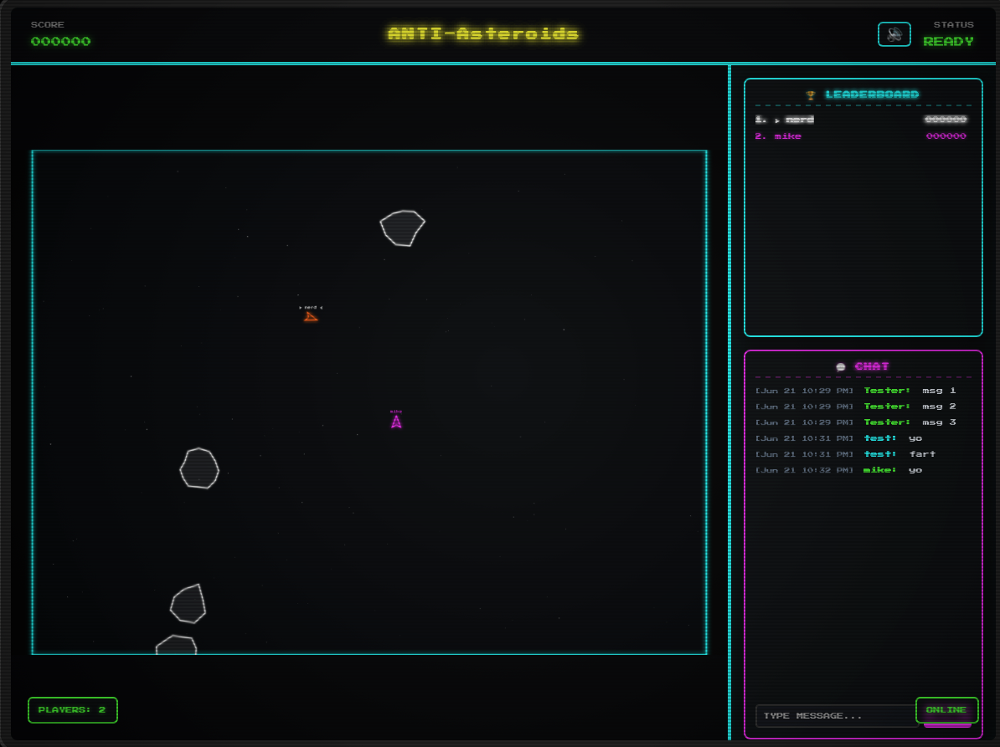

# Anti-Asteroids



A real-time multiplayer take on classic Asteroids, built with TypeScript. Fly a neon wedge ship through an asteroid field, shoot rocks for points, bounce off other players, and compete on a live leaderboard — all in a retro arcade UI with synthesized 8-bit audio.

## Features

- **Multiplayer** — Multiple players in the same arena over WebSockets
- **Authoritative server** — Physics, collisions, and scoring run on the server at 60 Hz
- **Retro presentation** — Canvas 2D rendering, CRT-style UI, procedural sound effects
- **Social** — Live chat and leaderboard sidebar
- **Mobile-friendly** — On-screen controls for touch devices
- **Low-bandwidth sync** — 15 Hz compact deltas with client-side dead reckoning for poor connections
- **Chat commands** — Public `/color` and `/help`; admin commands via `/admin <password>`

## Quick Start

```bash
npm install
npm run dev
```

Open the Vite dev server (typically `http://localhost:5173`) to play. The game server runs on port 3000.

For production:

```bash
npm run build
npm start
```

Then open `http://localhost:3000`.

### Admin mode

Set a server password to enable admin slash commands. Create a `.env` file in the project root (loaded automatically on startup):

```env
ADMIN_PASSWORD=your-secret
```

Or pass inline:

```bash
ADMIN_PASSWORD=your-secret npm start
```

In chat, run `/admin your-secret` to unlock commands like `/maxasteroids`, `/split off`, and `/spawn`.

## Tech Stack

- **Client** — Vite, Canvas 2D, Web Audio API
- **Server** — Node.js, Express, `ws`
- **Shared** — TypeScript types and constants used by both sides

## Documentation

See [docs/system.md](docs/system.md) for architecture, message flow, and implementation details.
